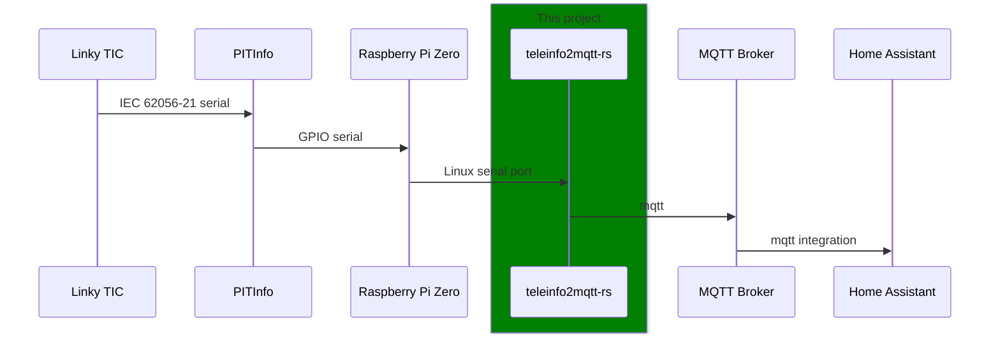
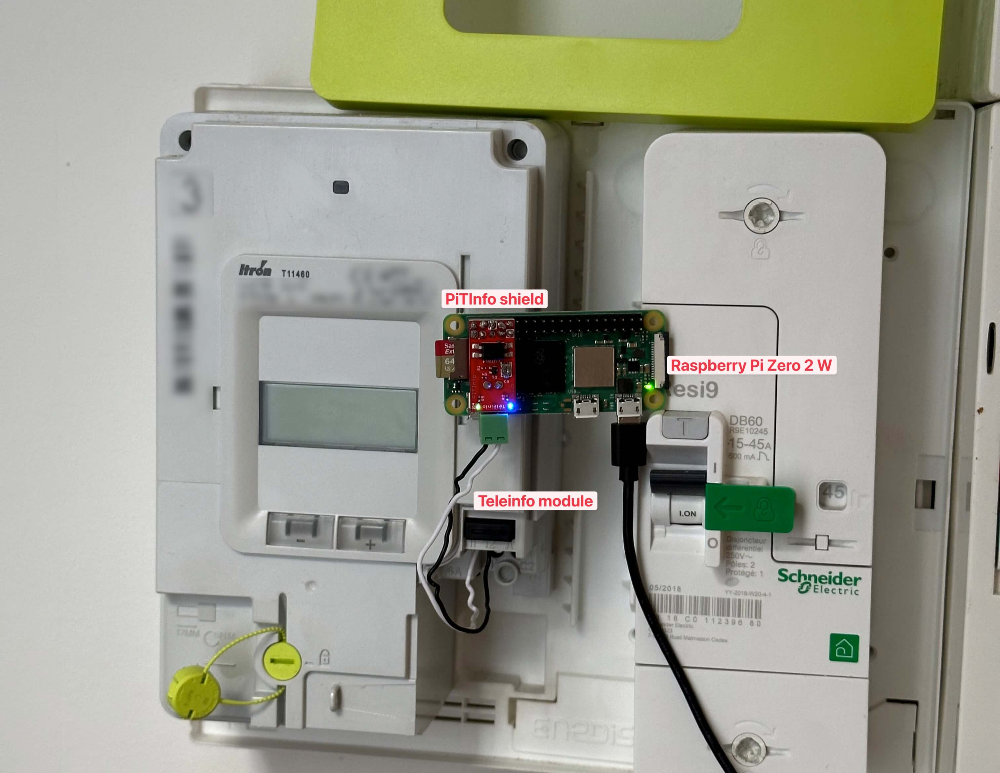
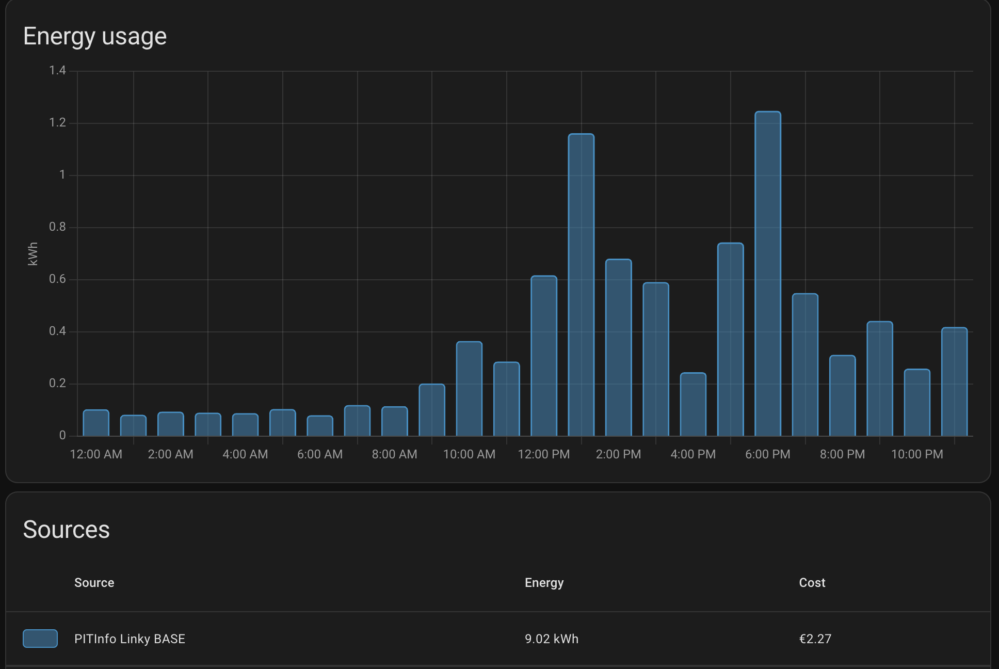
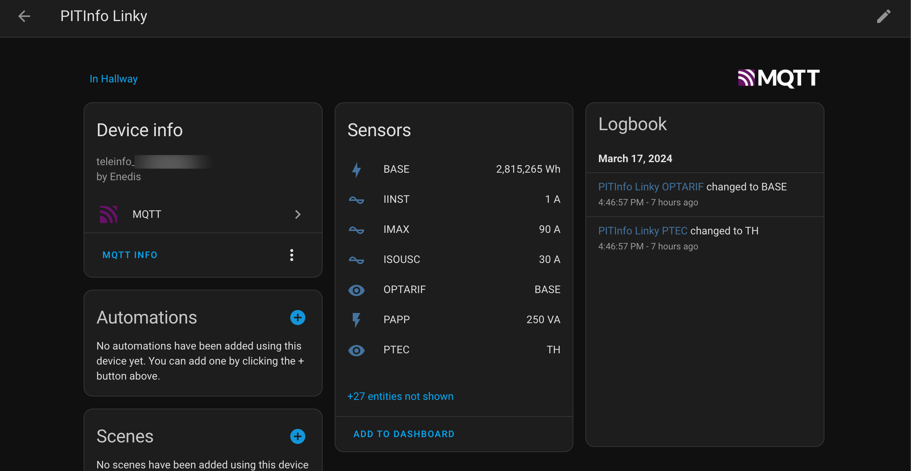
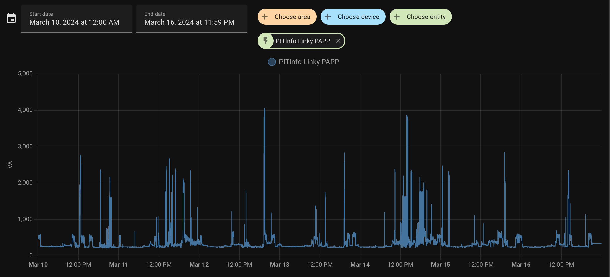
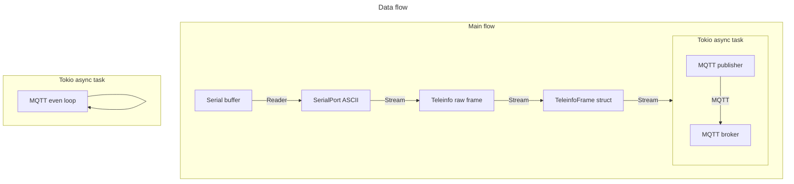

# teleinfo2mqtt-rs

Convert TeleInfo frames from a Linky meter's serial port to Home Assistant-compatible MQTT messages.

## Overview



## Reasoning

This is a rewrite of the [fmartinou/teleinfo2mqtt](https://github.com/fmartinou/teleinfo2mqtt) that is written in Javascript.

This was only done for learning purposes, as the original project is working perfectly fine.

The only advantage of this project is that it is written in Rust, which means a single binary to deploy and very low resource usage, which is perfect for a low-power device like a Raspberry Pi Zero 2 W, which is what I use.

It uses less than 1% of CPU and 2-3 MB of RAM on my Raspberry Pi:

```sh
pi@raspberrypiz ~> ps -p $(pgrep teleinfo2mqtt-r) -o %cpu,%mem,rss
%CPU %MEM   RSS
 0.5  0.5  2560
```

## Caveats

- Only supports "historical" Linky mode, not "standard" mode, because my Linky is in historical mode.
- MQTT discovery for Home Assistant is not implemented

## Usage

The following environment variables are required:

- `MQTT_HOST`: the MQTT broker to connect to, e.g. `192.168.1.42`
- `MQTT_USERNAME`: the MQTT broker username
- `MQTT_PASSWORD`: the MQTT broker password

The following environment variables are optional:

- `SERIAL_PORT`: the serial port to read from, defaults to `/dev/ttyS0`
- `MQTT_PORT`: the MQTT broker port to connect to, defaults to `1883`

The binary can then be run with:

```sh
./teleinfo2mqtt-rs
```

### My setup

My setup is as follows:

- Linky meter manufactured by Itron, historical mode
- [PiTInfo shield](https://www.tindie.com/products/hallard/pitinfo/) to get the serial data from the TIC module through the GPIO pins
- Raspberry Pi Zero 2 W to run the binary
- Mosquitto as the MQTT broker to receive the MQTT messages, running as an addon in Home Assistant
- Home Assistant to integrate the MQTT messages



### Home Assistant integration







## Development

The usual Rust commands apply:

```sh
cargo build
cargo run
```

### Architecture

The project is architected around `Stream`s from [`futures`](https://github.com/rust-lang/futures-rs).



### Cross-compilation

Unfortunately, I couldn't get cross-compilation to work from macOS `aarch64-apple-darwin` to `aarch64-unknown-linux-gnu` because of the `libudev-dev` dependency on Linux.

A VS Code Dev Container is provided to have a working `rust-analyzer` and `clippy` in VSCode on macOS and to be able to compile the project on Linux.

### TeleInfo specs

PDF from Enedis can be found under [docs/Enedis-NOI-CPT_54E.pdf](docs/Enedis-NOI-CPT_54E.pdf).

The important stuff is for historical mode is:

#### Physical layer

- The baud rate is 1200 bauds
- 7 data bits are used to represent each ASCII character

The teleinfo data can be read from the serial port using `picocom`:

```sh
sudo picocom -b 1200 -d 7 /dev/ttyS0
```

#### Data link layer

The TIC sends frames continuously. Each frame is separated by a delay of `16.7 ms < t < 33.4 ms`.

- Each frame is composed of multiple data sets
- Each data set is composed of a label, a value and a checksum
- Each frame starts with "Start TeXt" STX (`0x02`) and ends with "End TeXt" ETX (`0x03`)

```
STX<data set><data set>...<data set>ETX
```

A data set is composed of:

```
\n<Label>\t<Value>\t<Checksum>\r
```

The checksum is `(S1 & 0x3F) + 0x20`, considering `S1` the sum of the ASCII values from the label (included) to the checksum (excluded)

A full frame on my Linky meter looks like this:

```
0x02
ADCO 012345678912 B
OPTARIF BASE 0
ISOUSC 30 9
BASE 002815235 %
PTEC TH.. $
IINST 001 X
IMAX 090 H
PAPP 00260 )
HHPHC A ,
MOTDETAT 000000 B0x03
```

#### Application layer

In the code, the frame is represented as:

```rs
pub struct TeleinfoFrame {
    pub adco: String,     // Adresse du compteur
    pub optarif: String,  // Option tarifaire
    pub isousc: String,   // Intensité souscrite, en A
    pub base: String,     // Index option base, en Wh
    pub ptec: String,     // Période tarifaire en cours
    pub iinst: String,    // Intensité instantanée, en A
    pub imax: String,     // Intensité maximale appelée, en A
    pub papp: String,     // Puissance apparente, en VA (arrondie à la dizaine la plus proche)
    pub hhphc: String,    // Horaire Heures Pleines Heures Creuses
    pub motdetat: String, // Mot d'état du compteur
}
```
