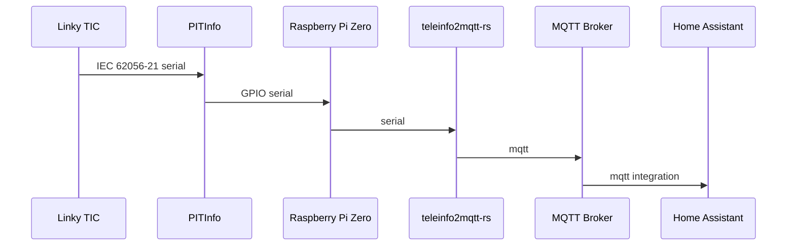

```mermaid
sequenceDiagram
    participant tic as Linky TIC
    participant pitinfo as PITInfo
    participant rpiz as Raspberry Pi Zero
    participant t2m as teleinfo2mqtt-rs
    participant mqtt as MQTT Broker
    participant ha as Home Assistant
    tic->>pitinfo: IEC 62056-21 serial
    pitinfo->>rpiz: GPIO serial
    rpiz->>t2m: serial
    t2m->>mqtt: mqtt
    mqtt->>ha: mqtt integration
```

- Only historical mode, not standard mode
